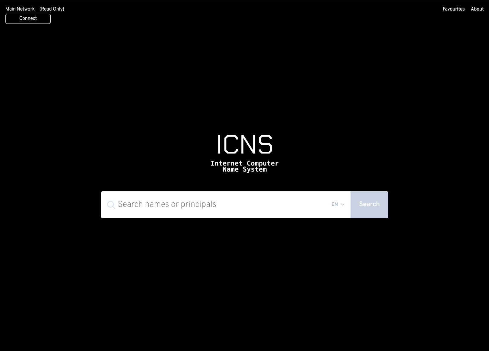
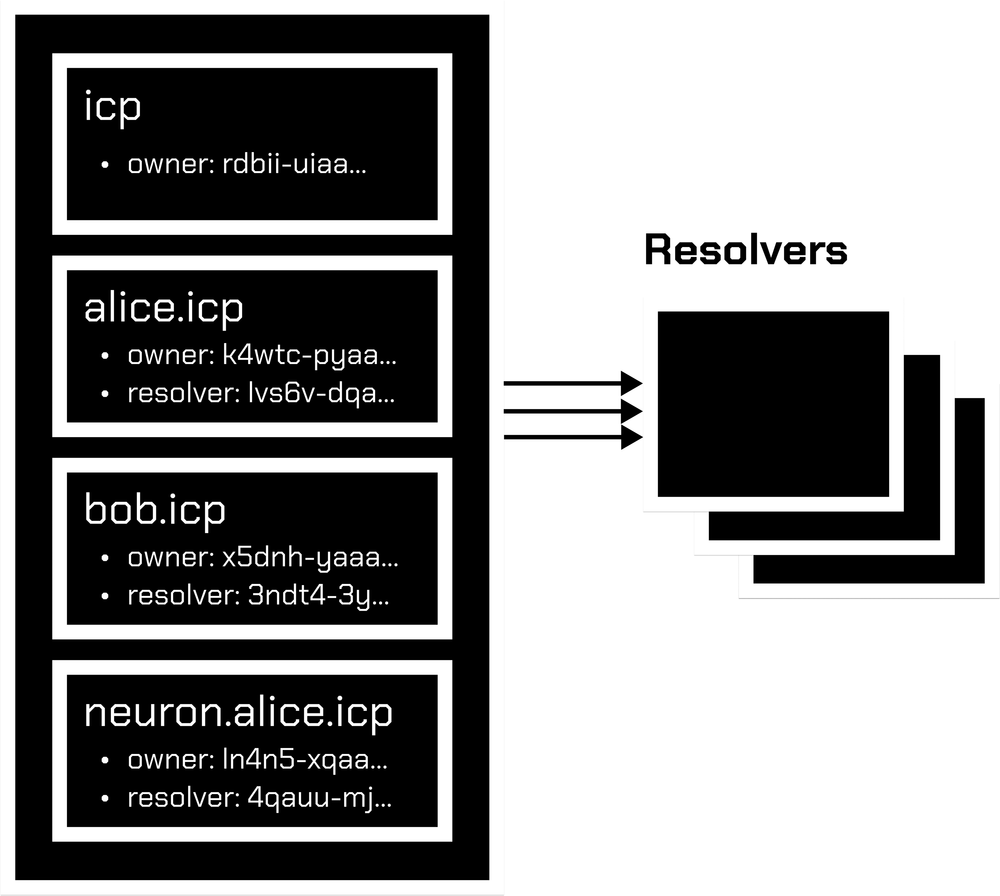

# IC Name System

The Internet Computer Name System (ICNS) is a native decentralized naming service built on the IC's application layer.

The ICNS's job is to map human-readable names like 'alice.icp' to machine-readable identifiers such as Principals, content hashes, metadata, and even DNS records. In this way, the ICNS is said to be entity-agnostic.

While the ICNS bears similarities to the Domain Name System (DNS) protocol, it is more comparable to Ethereum Name Service (ENS) in its design. Like DNS and ENS, ICNS operates on a system of dot-separated hierarchical names called domains, with the owner of a domain having full control over subdomains.

Top-level domains, like '.icp', are owned by canisters called registrars, which specify rules governing the allocation of their subdomains. Anyone may, by following the rules imposed by these registrar canisters, obtain ownership of a domain for their own use. Because of the hierarchal nature of ICNS, anyone who owns a domain at any level may configure subdomains—for themselves or others—as desired. For instance, if Alice owns 'alice.icp', she can create 'pay.alice.icp' and configure it as she wishes.

A feature that allows ICNS to stand apart from ENS is that it reduces the need for indirection when referencing assets hosted through decentralized storage (e.g. via IPFS). Additionally, the extensibility and upgradability of canisters themselves prove to unlock incredible potential for the evolution of name records; governance systems and sophisticated market systems can be built on top of the ICNS protol.

## Architecture

ICNS has two principal components: the registry, and resolvers.

The ICNS registry consists of a single smart contract that maintains a list of all domains and subdomains, and stores three critical pieces of information about each:

- The owner of the domain
- The resolver for the domain
- The caching expiry time for all records under the domain

The owner of a domain may be either a person or a canister. A registrar is simply a canister that owns a domain and issues subdomains of that domain to users that follow some set of rules defined in the contract.

Owners of domains in the ICNS registry may:

- Set the resolver and expiry for the domain
- Transfer ownership of the domain to another principal
- Change the ownership of subdomains

The ICNS registry is deliberately straightforward and exists only to map from a name to the resolver responsible for it.

Resolvers are responsible for the actual process of translating names into entities. Any canister that implements the relevant standards may act as a resolver in ICNS. General-purpose resolver implementations are offered for users whose requirements are straightforward, such as serving an infrequently changed principal for a name.

Each record type—principals, IPFS content hash, and so forth—defines a method or methods that a resolver must implement in order to provide records of that kind. New record types may be defined at any time via a governance-driven standardization process, with no need to make changes to the ICNS registry or to existing resolvers in order to support them.

## Canisters

### Registry

The ICNS registry is the main that lies at the heart of name resolution. All ICNS lookups start by querying the registry. The registry maintains a list of domains, recording the owner, resolver, and expiry (a.k.a. TTL) for each, and allows the owner of a domain to make changes to that data.

### RegistrarCore

Implementation of a simple first-in-first-served registrar, which issues (sub-)domains to the first account to request them. This serves as an example of the bare-minimum functionality required for a registrar to serve its intended purpose. It also implements the registrar for managing the the `*.icp` TLD.

### Resolver\[ Text | Neuron | \* \]

Resolvers implement a general-purpose ICNS resolver that is suitable for most standard use-cases. They permit updates to ICNS records by the owner of the corresponding entity.

## WIP Features

- 'Reverse resolution', making it possible to associate data such as canonical names or interface descriptions with Principals
- UTS-46 normalization
- Minimal governance for proposing new TLDs
- Extensible governance for evolving registrars through DAOs
